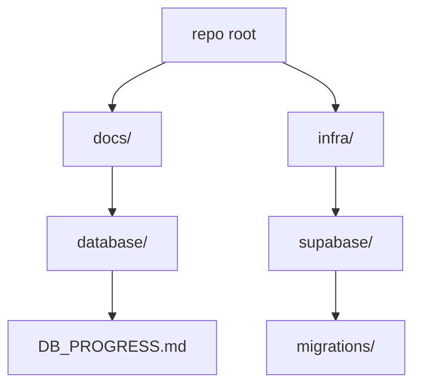
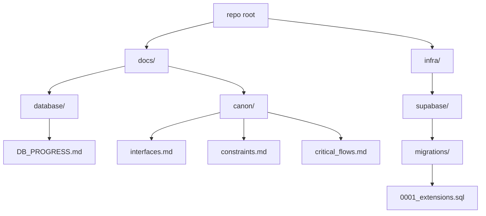
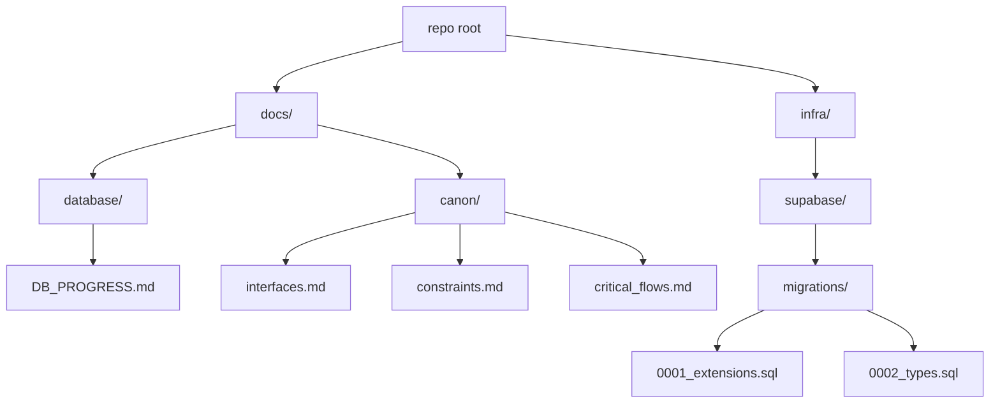
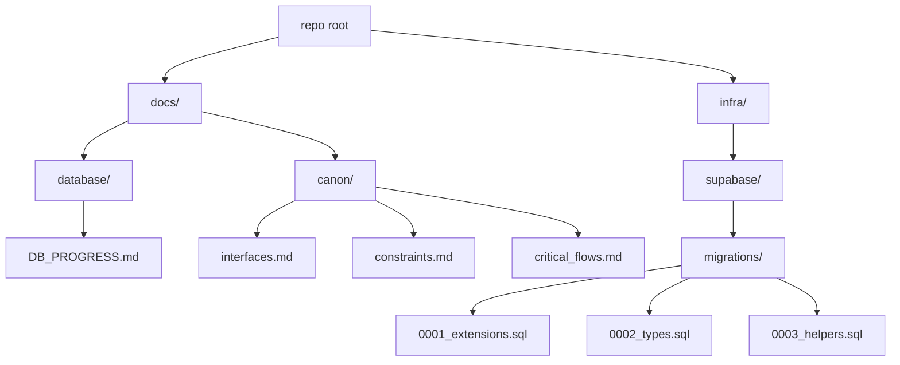

# Tithi DB — Progress Log

## How to read this
- This document is the single source of truth for database work across prompts P0000 → P0019.
- Each section records the full context: inputs reviewed, reasoning, intermediate steps, decisions, outputs, and the database state snapshot after the step.
- We strictly follow the Execution Context Rule: align with Design Brief > Context Pack > Cheat Sheets.
- After each prompt, we include “Canon updates” counts to help CI verify coverage.
- Read newest section last; earlier sections remain immutable records.

---

## Execution Context Rule (acknowledged for P0000)
We loaded and aligned with all three canonical sources before making changes:
- Design Brief: `docs/database/design_brief.md`
- Context Pack: `docs/database/database_context_pack.md`
- Cheat Sheets: `docs/database/cheat sheets/interfaces.md`, `docs/database/cheat sheets/constraints.md`, `docs/database/cheat sheets/critical_flows.md`

Priority of resolution: Design Brief → Context Pack → Cheat Sheets. Fail-safe posture: if an invariant would be broken, halt and surface the violation.

---

## P0000 — Initialize DB folder + progress doc (no SQL)

### Inputs consulted
- `docs/database/tasks.md` — Task 00 specification: create `infra/supabase/migrations/`, create root `docs/`, and create `docs/DB_PROGRESS.md` with a title and short “How to read this”; output one fenced block with full contents of `docs/DB_PROGRESS.md`.
- `docs/database/design_brief.md` — Final authoritative schema and rules, including RLS everywhere, path-slug tenancy, enumerations, constraints, triggers, and acceptance criteria. No domains table pre-0019. CI expectations include references to the Execution Context Rule and canon counts.
- `docs/database/database_context_pack.md` — Guardrails, invariants, prompt-by-prompt outcomes, and Canon Appends coverage guidance. Emphasizes additive-only changes, transactions, RLS deny-by-default, and documentation rigor.
- Cheat Sheets (currently empty placeholders):
  - `docs/database/cheat sheets/interfaces.md`
  - `docs/database/cheat sheets/constraints.md`
  - `docs/database/cheat sheets/critical_flows.md`

### Reasoning and intermediate steps
- Verified existing repository structure to avoid collisions with any existing progress files; we retain `docs/database/DB_PROGRESS.md` as the canonical progress log.
- Created `infra/supabase/migrations/` to establish the canonical path for migrations 0001 → 0019.
- Composed this self-contained progress log to satisfy both Task 00 and the extended reporting requirements (complete record of inputs, reasoning, outputs, and a state snapshot).
- Included an explicit mention of the Execution Context Rule and canon counts to align with CI expectations described in the Design Brief and Context Pack.

### Actions taken (outputs produced)
- Created folder: `infra/supabase/migrations/` (with a `.gitkeep` for VCS visibility).
- Created/updated file: `docs/database/DB_PROGRESS.md` (this document).

### Plain-language description
We set up the base folders for database migrations and wrote this progress log. No SQL or schema was created in this step. This file explains how future steps will be documented and verified.

### Rationale and connection to the Design Brief
- The Design Brief and Context Pack define a rigorous, stepwise path (P0000 → P0019). Task 00 creates the scaffolding and a durable audit of decisions so every subsequent migration and policy change is traceable.
- Documenting the Execution Context Rule and canon counts now ensures CI/reviewers can enforce alignment from the very first step.

### Decisions made
- Keep existing `docs/database/DB_PROGRESS.md` untouched; introduce canonical root `docs/DB_PROGRESS.md` per Task 00.
- Add `.gitkeep` to `infra/supabase/migrations/` to ensure the folder is tracked before SQL is added.
- Record canon counts for P0000 as zeroes (no interfaces/constraints/flows are introduced in this step).

### Pitfalls / tricky parts
- Avoid producing any SQL or out-of-scope files during initialization.
- Ensure we output exactly one fenced block in PR/chats for Task 00 when requested, matching the instruction in `tasks.md`.
- Maintain the additive-only rule from the outset: scaffolding should not preclude later additive evolutions.

### Questions for Future Me
- Do we want to add a dedicated `docs/canon/` directory in a later step (as required by P0001+ prompts) to store per-prompt canon append sections? Likely yes, starting at P0001 when those outputs first appear.
- Should we add a short “CI signals” subsection to each future section to track expected presence of Execution Context Rule mention and canon counts? This document already includes both for P0000; we can continue the pattern.

### State Snapshot (after P0000)
- Tables: none created
- Enums: none created
- Functions: none
- Triggers: none
- Policies (RLS): none (RLS will be enabled from P0014 onward per plan)
- Indexes: none
- Migrations folder: present at `infra/supabase/migrations/`
- Tests (pgTAP): none yet
- Documentation backbone: this file created and serving as canonical progress log

### Visual representation (current repository areas relevant to DB)


### Canon updates for P0000
Canon updates for P0000 → interfaces: 0, constraints: 0, flows: 0

---

## 0001 — Extensions

### Inputs consulted
- `docs/database/tasks.md` — Task 01 specification: create `infra/supabase/migrations/0001_extensions.sql` with `BEGIN; … COMMIT;` and add four extensions via `CREATE EXTENSION IF NOT EXISTS`.
- `docs/database/design_brief.md` — Confirms required extensions (pgcrypto, citext, btree_gist, pg_trgm) and idempotent, transactional migrations.
- `docs/database/database_context_pack.md` — Reiterates 0001 adds these extensions and mandates transactions, idempotency, and documentation with canon updates.
- Cheat Sheets (currently stubs): `docs/database/cheat sheets/interfaces.md`, `constraints.md`, `critical_flows.md` (no new entries for this step).

Execution Context Rule honored: we aligned outputs with the Design Brief > Context Pack > Cheat Sheets priority. No invariant was at risk for this step.

### Reasoning and intermediate steps
- Verified `infra/supabase/migrations/` exists and added the first numbered migration file.
- Ensured extension creation is idempotent (`IF NOT EXISTS`) and wrapped in a single transaction to satisfy CI/guardrails.
- Decided to place all four extensions in the default schema context (standard for Postgres/Supabase) without extra options to keep it portable across environments.
- Created `docs/canon/` directory and appended required P0001 sections with accurate counts.

### Actions taken (outputs produced)
- Created migration: `infra/supabase/migrations/0001_extensions.sql` containing:
  - `CREATE EXTENSION IF NOT EXISTS pgcrypto;`
  - `CREATE EXTENSION IF NOT EXISTS citext;`
  - `CREATE EXTENSION IF NOT EXISTS btree_gist;`
  - `CREATE EXTENSION IF NOT EXISTS pg_trgm;`
  - All within `BEGIN; … COMMIT;`.
- Created canon files and appended sections:
  - `docs/canon/interfaces.md` → `### P0001 — Interfaces` (Count: 0)
  - `docs/canon/constraints.md` → `### P0001 — Constraints` (Count: 0)
  - `docs/canon/critical_flows.md` → `### P0001 — Critical Flows` (Count: 0)

### Plain-language description
We enabled four core Postgres extensions needed by later steps: cryptographic helpers and UUID utilities (pgcrypto), case-insensitive text (citext), support for exclusion constraints that combine BTREE + GiST (btree_gist), and trigram-based search acceleration (pg_trgm). No tables, policies, or triggers were added yet.

### Rationale and connection to the Design Brief
- pgcrypto: required for UUIDs/crypto operations, seeding, and secure tokens.
- citext: enables case-insensitive email/user lookups without fragile LOWER() patterns.
- btree_gist: needed to implement GiST exclusions for no-overlap bookings alongside equality.
- pg_trgm: future-friendly fuzzy search and chips/category UX without premature GIN creation.
These choices directly fulfill the Brief’s “Extensions” and prepare for Booking overlap, CRM lookups, and search UX.

### Decisions made
- Keep migration minimal and strictly idempotent; no optional or experimental extensions added.
- Do not add indexes at this stage (Indexing Rule: only where explicitly permitted later).
- Initialize canon tracking with zero counts since extensions do not create schema interfaces, constraints, or flows.

### Pitfalls / tricky parts
- Extensions require appropriate privileges; Supabase projects typically allow these via migration role.
- Ensure single-transaction semantics so partially installed extensions do not occur.
- Avoid adding any schema objects prematurely that could conflict with future prompts.

### Questions for Future Me
- Any environment that lacks these extensions? If so, document a contingency plan (e.g., feature flags or conditional migrations) while keeping 00–19 canonical.
- Should we document extension versions observed in dev to aid reproducibility? Not required now, but could help debugging.

### State Snapshot (after P0001)
- Extensions: pgcrypto, citext, btree_gist, pg_trgm (installed)
- Tables: none created yet
- Enums: none yet (to be added in P0002)
- Functions/Triggers: none yet (helpers in P0003; generic touch/booking triggers in later prompts)
- Policies (RLS): none yet (to be enabled in P0014+)
- Indexes: none (index pass occurs at P0017)
- Migrations present: `0001_extensions.sql`
- Tests (pgTAP): none yet (added at P0019)
- Documentation backbone: this file updated with P0001 details

### Visual representation (repo paths after P0001)


### Canon updates for P0001
Canon updates for P0001 → interfaces: 0, constraints: 0, flows: 0

---

## 0002 — Types

### Inputs consulted
- `docs/database/tasks.md` — Task 02 specification enumerating all required enums, their exact values, and ordering; mandates `BEGIN; … COMMIT;` and idempotent `CREATE TYPE IF NOT EXISTS`.
- `docs/database/design_brief.md` — Final authoritative source confirming enum sets for bookings, payments, memberships, resources, notifications, and payment methods; stresses immutability of enum ordering and values.
- `docs/database/database_context_pack.md` — Guardrails and invariants: additive-only migrations, transactional integrity, and canon updates. Notes later usage of these enums in tables, policies, and flows.
- Cheat Sheets (currently stubs): `docs/database/cheat sheets/interfaces.md`, `constraints.md`, `critical_flows.md` (no new entries for this step).

Execution Context Rule honored: aligned outputs to Design Brief → Context Pack → Cheat Sheets. No invariant conflicts found.

### Reasoning and intermediate steps
- Enumerations are foundational primitives used by later tables and triggers (bookings, payments, notifications). They must be correct, stable, and ordered now; later edits to enum sets are disallowed.
- For idempotency and safe re-runs, we used `CREATE TYPE IF NOT EXISTS` for each enum and wrapped all statements in a single transaction.
- Names mirror domain language from the Brief. Values are lower_snake_case; ordering reflects lifecycle progression where applicable (e.g., `pending → confirmed → checked_in → completed` and terminal states).
- Chose add-only posture: no indexes, tables, constraints, or policies introduced here; those come in subsequent prompts that reference these types.

### Actions taken (outputs produced)
- Created migration: `infra/supabase/migrations/0002_types.sql` containing `BEGIN; … COMMIT;` and definitions for:
  - `booking_status` = {pending, confirmed, checked_in, completed, canceled, no_show, failed}
  - `payment_status` = {requires_action, authorized, captured, refunded, canceled, failed}
  - `membership_role` = {owner, admin, staff, viewer}
  - `resource_type` = {staff, room}
  - `notification_channel` = {email, sms, push}
  - `notification_status` = {queued, sent, failed}
  - `payment_method` = {card, cash, apple_pay, paypal, other}

### Plain-language description
We introduced typed status/role/channel/method enums to standardize states across bookings, payments, memberships, resources, and notifications. These enforce valid values at the DB layer and enable concise constraints, policies, and flows later (e.g., overlap rules depend on “active” booking statuses).

### Rationale and where each enum is used
- `booking_status` — Captures the booking lifecycle. Active set `{pending, confirmed, checked_in}` participates in the no-overlap exclusion (later in P0008). Terminal states `{completed, canceled, no_show, failed}` exclude records from overlap checks and drive notifications.
- `payment_status` — Models payment orchestration: from `requires_action` and `authorized`, to `captured` and post-settlement outcomes (`refunded`, `canceled`, `failed`). Used in payments/billing tables (P0009) and flows.
- `membership_role` — Tenant roles: `owner`, `admin`, `staff`, `viewer`. Guides special and standard RLS policies (P0015–P0016) and UI affordances.
- `resource_type` — Differentiates schedulable resources: `staff` vs `room`. Used in resources/services mapping and availability (P0005–P0007).
- `notification_channel` — Outbound channels supported by the notifications subsystem: `email`, `sms`, `push` (introduced here; used in P0011).
- `notification_status` — Worker/queue state: `queued`, `sent`, `failed`. Used by notifications outbox/queue (P0011) and observability.
- `payment_method` — Tender methods permitted by policy and UX: `card`, `cash`, `apple_pay`, `paypal`, `other`. Used in payments (P0009) and reporting.

### Decisions made
- Locked exact value ordering to preserve semantic progression and ensure deterministic behavior in constraints and business logic.
- Used `IF NOT EXISTS` for idempotency across environments; one transaction to avoid partial creation.
- Aligned naming and spellings with the Brief (`apple_pay`, not `applepay`; `no_show`, not `no-show`).

### Pitfalls / tricky parts
- PostgreSQL enums cannot have members reordered or removed. Adding new values later requires careful additive migrations and potential casting; design avoids that by defining the complete sets now per Brief.
- Downstream constraints will rely on subsets (e.g., “active” booking statuses). Any drift would risk overlap logic or policy edge cases.
- Cross-system serialization must mirror DB enums exactly in APIs and events to avoid invalid state writes.

### Questions for Future Me
- Do we foresee new channels (e.g., WhatsApp) or payment methods (e.g., bank_transfer)? If so, plan an additive pattern (new enum + compatibility views) instead of mutating existing enums.
- Should we expose these enums via generated types in `/src/types/` to keep client/server contracts in lockstep? Likely when interfaces stabilize.

### State Snapshot (after P0002)
- Extensions: pgcrypto, citext, btree_gist, pg_trgm
- Enums: booking_status, payment_status, membership_role, resource_type, notification_channel, notification_status, payment_method (created)
- Tables: none created yet
- Functions/Triggers: none yet
- Policies (RLS): none yet
- Indexes: none
- Migrations present: `0001_extensions.sql`, `0002_types.sql`
- Tests (pgTAP): none yet
- Documentation: this file updated with P0002 details

### Visual representation (repo paths and types after P0002)


### Canon updates for P0002
Canon updates for P0002 → interfaces: 7, constraints: 0, flows: 0

---

## 0003 — RLS Helper Functions

### Inputs consulted
- `docs/database/tasks.md` — Task 03 specification: create `infra/supabase/migrations/0003_helpers.sql` with two STABLE, SECURITY INVOKER helpers returning `uuid` and NULL on missing/invalid claims.
- `docs/database/design_brief.md` — Confirms strict RLS everywhere, fail-closed policies, and use of standard helpers for tenant/user context.
- `docs/database/database_context_pack.md` — Guardrails on idempotency, transactions, additive-only, and canonical migration sequence.
- Cheat Sheets (stubs for now): `docs/database/cheat sheets/interfaces.md`, `constraints.md`, `critical_flows.md` (no new items for this step).

Execution Context Rule honored: outputs aligned with Design Brief → Context Pack → Cheat Sheets. No invariant conflicts.

### Reasoning and intermediate steps
- Defined helpers as `LANGUAGE sql`, `STABLE`, `SECURITY INVOKER` so they execute in caller context and are safe for RLS predicates.
- Implemented NULL-on-missing behavior by extracting claims via `auth.jwt()->>'tenant_id'` / `->>'sub'` and returning NULL when absent or invalid.
- Hardened UUID parsing using a case-insensitive regex; only valid UUIDs cast to `uuid` to avoid exceptions in policies.
- Used `CREATE OR REPLACE FUNCTION` and wrapped the migration in `BEGIN; … COMMIT;` for idempotency and transactional safety.
- Avoided the JSONB key-existence `?` operator and instead used NULL-safe `->>` extraction for broader compatibility and clarity.

### Actions taken (outputs produced)
- Created migration: `infra/supabase/migrations/0003_helpers.sql` defining:
  - `public.current_tenant_id()` → returns tenant UUID from JWT `tenant_id` claim or NULL on missing/invalid.
  - `public.current_user_id()` → returns user UUID from JWT `sub` claim or NULL on missing/invalid.
- Both helpers: `STABLE`, `SECURITY INVOKER`, `RETURNS uuid`, `RETURNS NULL ON NULL INPUT`, transactional and idempotent.

### Plain-language description
Supabase injects an authenticated request’s JWT into Postgres, readable via `auth.jwt()`. These helpers parse `tenant_id` and `sub` from that JSON and return them as UUIDs. If claims are missing or malformed, they return NULL so RLS comparisons (e.g., `tenant_id = current_tenant_id()`) fail closed by default.

### Rationale and connection to the Design Brief
- The Brief mandates deny-by-default RLS and standards-based helpers. Returning NULL on bad claims ensures policies remain fail-closed.
- Using SQL functions keeps policies readable and repeatable across tables and future prompts (P0014–P0016).

### Decisions made
- Use regex validation before UUID cast to prevent runtime errors inside policies.
- Prefer `->>` extraction over `?` existence checks; both are safe, but `->>` is simpler and still NULL-safe.
- Keep functions in `public` schema per Brief’s conventions for shared helpers.

### Pitfalls / tricky parts
- `auth.jwt()` may be NULL (anon role); `->>` safely yields NULL, making helpers return NULL—desired for deny-by-default.
- Policies must avoid `IS NOT NULL` misuses that could accidentally allow access; comparisons using `=` with NULL remain deny-by-default.
- STRICT/`RETURNS NULL ON NULL INPUT` has no effect for no-arg functions but is included to meet the spec and future-proof API.

### Questions for Future Me
- Will any service accounts use non-UUID `sub`? If so, add a separate helper or compatibility layer rather than weakening validation.
- Should we expose these helpers via generated client types or document them in app-layer auth docs? Likely when policies land (P0014–P0016).

### State Snapshot (after P0003)
- Extensions: pgcrypto, citext, btree_gist, pg_trgm
- Enums: booking_status, payment_status, membership_role, resource_type, notification_channel, notification_status, payment_method
- Tables: none yet
- Functions: `public.current_tenant_id()`, `public.current_user_id()` (created)
- Triggers: none
- Policies (RLS): none yet (enable at P0014)
- Indexes: none
- Migrations present: `0001_extensions.sql`, `0002_types.sql`, `0003_helpers.sql`
- Tests (pgTAP): none yet
- Documentation: this file updated with P0003 details

### Visual representation (repo paths and helpers after P0003)


---

## Checkpoint — After P0003

• Extensions installed: `pgcrypto`, `citext`, `btree_gist`, `pg_trgm` (via `infra/supabase/migrations/0001_extensions.sql`).
• Enums defined (immutable ordering): `booking_status`, `payment_status`, `membership_role`, `resource_type`, `notification_channel`, `notification_status`, `payment_method` (via `0002_types.sql`).
• Helpers created: `public.current_tenant_id()`, `public.current_user_id()` (NULL-safe; regex-validated UUIDs) (via `0003_helpers.sql`).

State snapshot now:
- Tables: none yet
- RLS: not enabled yet (planned at 0014–0016)
- Indexes: none yet (planned at 0017)
- Tests: none yet (planned at 0019)
- Migrations present: 0001, 0002, 0003

Environment note:
- Helpers rely on `auth.jwt()`; when absent (anon/test), they return NULL, preserving deny-by-default behavior.
- For verification in non-auth environments, run as `postgres`/service-role or set JWT claims so helpers can resolve UUIDs.

Cumulative canon counts (P0000–P0003): interfaces: 9, constraints: 0, flows: 1

Ready next steps (guidance):

---
## 0004 — Core Tenancy Schema

### Inputs consulted
- `docs/database/tasks.md` — Task 04 specification: implement `public.touch_updated_at()` and create `tenants`, `users` (global), `memberships`, `themes`; idempotent, transactional; attach triggers; soft-delete on `tenants` via `deleted_at` and partial unique on `slug`.
- `docs/database/design_brief.md` — Confirms path-based tenancy (`/b/{slug}`), global users, memberships with `membership_role`, themes 1:1, soft-delete pattern with partial unique indexes, and additive-only migrations. RLS deferred to 0014–0016.
- `docs/database/database_context_pack.md` — Reinforces invariants: transactions, idempotency, no domains table pre-0019, helper functions behavior, and canon documentation requirements.

Execution Context Rule honored: aligned with Design Brief → Context Pack → Cheat Sheets. No invariant conflicts.

### Reasoning and intermediate steps
- Wrote a generic `public.touch_updated_at()` trigger fn to set `NEW.updated_at = now()`; attached only to tables that include the column.
- Followed path-based tenancy: introduced `public.tenants(slug)` with soft-delete via `deleted_at` and a partial unique index on `slug` when not deleted.
- Kept `public.users` global (no `tenant_id`). Linking is via `public.memberships(tenant_id, user_id)` with role `public.membership_role` and `permissions_json`.
- Modeled theming as 1:1 with tenants using `public.themes(tenant_id PK/FK)`. All tables have `created_at`/`updated_at` timestamps.
- Ensured idempotent creation for tables, indexes, and triggers; wrapped entire migration in one transaction.
- Deferred RLS policies per plan; ensured helpers from P0003 will support fail-closed policies later.

### Actions taken (outputs produced)
- Created migration: `infra/supabase/migrations/0004_core_tenancy.sql`:
  - Function: `public.touch_updated_at()` (PL/pgSQL trigger)
  - Table: `public.tenants` with soft-delete `deleted_at`
  - Index: partial unique `tenants(slug) WHERE deleted_at IS NULL`
  - Table: `public.users` (global)
  - Table: `public.memberships` with FKs to `tenants(id)` and `users(id)`; UNIQUE `(tenant_id, user_id)`
  - Table: `public.themes` with `tenant_id` as PK and FK to `tenants(id)` (1:1)
  - Triggers: `<table>_touch_updated_at` on `tenants`, `users`, `memberships`, `themes` (idempotent DO block)
- Updated canon files:
  - `docs/database/canon/interfaces.md` → `### P0004 — Interfaces` (Function + 4 tables). Count: 5
  - `docs/database/canon/constraints.md` → `### P0004 — Constraints` (partial unique, unique, FKs). Count: 6
  - `docs/database/canon/critical_flows.md` → `### P0004 — Critical Flows` (tenancy resolution; timestamp freshness). Count: 2

### Plain-language description
We added the core tenancy building blocks. `tenants` anchors the tenant namespace by slug; `users` is global. `memberships` connects users to tenants with a role and optional granular permissions. `themes` stores branding per tenant. A reusable trigger keeps `updated_at` fresh on writes across these tables.

### Rationale and connection to the Design Brief
- Path-based tenancy keeps routing simple now; domains can be added later (post-0019) without breaking invariants.
- Global users avoid duplicated identities across tenants; membership captures role/permissions per tenant.
- Soft-delete with partial unique on `slug` preserves historical records while enforcing uniqueness among active tenants.
- Generic `touch_updated_at` encourages consistency and low maintenance.

### Decisions made
- No RLS yet; all RLS/policies will be introduced in P0014–P0016 per plan.
- Table/column names and trigger names adhere strictly to naming conventions in the Brief.
- Idempotent DO-block for triggers to avoid duplicate creation on re-runs.

### Pitfalls / tricky parts
- `touch_updated_at` assumes presence of `updated_at`; we only attach it to tables that define the column.
- Soft-delete uniqueness requires the partial index scope `WHERE deleted_at IS NULL` to prevent false conflicts.

### Questions for Future Me
- Should we add audit columns (e.g., created_by) once RLS lands? Likely in later audit tasks.
- Any need for tenant-scoped uniqueness on `users.primary_email`? Not for global users; tenant-level CRM uniqueness will land with `customers` in P0005.

### State Snapshot (after P0004)
- Extensions: pgcrypto, citext, btree_gist, pg_trgm
- Enums: booking_status, payment_status, membership_role, resource_type, notification_channel, notification_status, payment_method
- Functions: `public.current_tenant_id()`, `public.current_user_id()`, `public.touch_updated_at()`
- Tables: `public.tenants`, `public.users`, `public.memberships`, `public.themes`
- Triggers: `tenants_touch_updated_at`, `users_touch_updated_at`, `memberships_touch_updated_at`, `themes_touch_updated_at`
- Policies (RLS): none yet (planned at P0014–P0016)
- Indexes: partial unique on `tenants(slug) WHERE deleted_at IS NULL`; unique on `memberships(tenant_id, user_id)`
- Migrations present: `0001_extensions.sql`, `0002_types.sql`, `0003_helpers.sql`, `0004_core_tenancy.sql`
- Tests (pgTAP): none yet (planned at P0019)
- Documentation: this file updated; canon files updated with P0004 sections

### Visual representation (repo paths after P0004)
```mermaid
flowchart TD
  A[repo root] --> B[docs/]
  B --> B1[database/]
  B1 --> B2[DB_PROGRESS.md]
  B --> C[canon/]
  C --> C1[interfaces.md]
  C --> C2[constraints.md]
  C --> C3[critical_flows.md]
  A --> D[infra/]
  D --> E[supabase/]
  F --> G3[0003_helpers.sql]
  F --> G4[0004_core_tenancy.sql]

### Canon updates for P0004
Canon updates for P0004 → interfaces: 5, constraints: 6, flows: 2

---
## Checkpoint — After P0004

• Extensions installed: `pgcrypto`, `citext`, `btree_gist`, `pg_trgm`.
• Enums defined: `booking_status`, `payment_status`, `membership_role`, `resource_type`, `notification_channel`, `notification_status`, `payment_method`.
• Helpers + trigger fn: `public.current_tenant_id()`, `public.current_user_id()`, `public.touch_updated_at()`.
• Core tables: `tenants`, `users` (global), `memberships`, `themes`; triggers attached; soft-delete uniqueness on `tenants.slug`.

State snapshot now:
- Tables: tenants, users, memberships, themes
- RLS: not enabled yet (planned at 0014–0016)
- Indexes: partial unique on tenants(slug) WHERE deleted_at IS NULL; unique on memberships(tenant_id, user_id)
- Tests: none yet (planned at 0019)
- Migrations present: 0001, 0002, 0003, 0004

Cumulative canon counts (P0000–P0004): interfaces: 14, constraints: 6, flows: 3

### Supabase verification snapshots (after P0004)

{{ ... }}

 What each section shows:
 - __Extensions__: Installed modules and versions required by the brief.
 - __Enums__: Canonical enum names and their ordered labels (ordering is immutable).
 - __Functions__: Selected function DDL as defined in the database.
 - __Tables & Columns__: Column-level schema for `tenants`, `users`, `memberships`, `themes`.
 - __Indexes__: Primary keys, uniques, and partial unique on `tenants.slug` (soft-delete aware).
 - __Constraints__: Primary keys, foreign keys, and soft-delete CHECK.
 - __Triggers__: `touch_updated_at` trigger presence per table.
 - __RLS status__: Confirmed off pre-0014.

 #### Extensions (installed)

 | extname     | extversion |
 | ----------- | ---------- |
 | btree_gist  | 1.7        |
 | citext      | 1.6        |
 | pg_trgm     | 1.6        |
 | pgcrypto    | 1.3        |

 #### Enums (names and ordered labels)

 | enum_name            | enumsortorder | enumlabel       |
 | -------------------- | ------------- | --------------- |
 | booking_status       | 1             | pending         |
 | booking_status       | 2             | confirmed       |
 | booking_status       | 3             | checked_in      |
 | booking_status       | 4             | completed       |
 | booking_status       | 5             | canceled        |
 | booking_status       | 6             | no_show         |
 | booking_status       | 7             | failed          |
 | membership_role      | 1             | owner           |
 | membership_role      | 2             | admin           |
 | membership_role      | 3             | staff           |
 | membership_role      | 4             | viewer          |
 | notification_channel | 1             | email           |
 | notification_channel | 2             | sms             |
 | notification_channel | 3             | push            |
 | notification_status  | 1             | queued          |
 | notification_status  | 2             | sent            |
 | notification_status  | 3             | failed          |
 | payment_method       | 1             | card            |
 | payment_method       | 2             | cash            |
 | payment_method       | 3             | apple_pay       |
 | payment_method       | 4             | paypal          |
 | payment_method       | 5             | other           |
 | payment_status       | 1             | requires_action |
 | payment_status       | 2             | authorized      |
 | payment_status       | 3             | captured        |
 | payment_status       | 4             | refunded        |
 | payment_status       | 5             | canceled        |
 | payment_status       | 6             | failed          |
 | resource_type        | 1             | staff           |
 | resource_type        | 2             | room            |

 #### Function DDL (sample)

 Only `current_user_id()` DDL was captured in this snapshot; others are defined in migrations and can be dumped similarly.

 ```sql
 CREATE OR REPLACE FUNCTION public.current_user_id()
  RETURNS uuid
  LANGUAGE sql
  STABLE STRICT
 AS $function$
   SELECT
     CASE
       WHEN (auth.jwt()->>'sub') IS NOT NULL
        AND (auth.jwt()->>'sub') ~* '^[0-9a-f]{8}-[0-9a-f]{4}-[0-9a-f]{4}-[0-9a-f]{4}-[0-9a-f]{12}$'
       THEN (auth.jwt()->>'sub')::uuid
       ELSE NULL::uuid
     END;
 $function$
 ```

 #### Tables and columns

 | table_name  | column_name         | data_type                | is_nullable | column_default    |
 | ----------- | ------------------- | ------------------------ | ----------- | ----------------- |
 | memberships | id                  | uuid                     | NO          | gen_random_uuid() |
 | memberships | tenant_id           | uuid                     | NO          | null              |
 | memberships | user_id             | uuid                     | NO          | null              |
 | memberships | role                | USER-DEFINED             | NO          | null              |
 | memberships | permissions_json    | jsonb                    | NO          | '{}'::jsonb       |
 | memberships | created_at          | timestamp with time zone | NO          | now()             |
 | memberships | updated_at          | timestamp with time zone | NO          | now()             |
 | tenants     | id                  | uuid                     | NO          | gen_random_uuid() |
 | tenants     | slug                | text                     | NO          | null              |
 | tenants     | tz                  | text                     | NO          | 'UTC'::text       |
 | tenants     | trust_copy_json     | jsonb                    | NO          | '{}'::jsonb       |
 | tenants     | is_public_directory | boolean                  | NO          | false             |
 | tenants     | public_blurb        | text                     | YES         | null              |
 | tenants     | billing_json        | jsonb                    | NO          | '{}'::jsonb       |
 | tenants     | created_at          | timestamp with time zone | NO          | now()             |
 | tenants     | updated_at          | timestamp with time zone | NO          | now()             |
 | tenants     | deleted_at          | timestamp with time zone | YES         | null              |
 | themes      | tenant_id           | uuid                     | NO          | null              |
 | themes      | brand_color         | text                     | YES         | null              |
 | themes      | logo_url            | text                     | YES         | null              |
 | themes      | theme_json          | jsonb                    | NO          | '{}'::jsonb       |
 | themes      | created_at          | timestamp with time zone | NO          | now()             |
 | themes      | updated_at          | timestamp with time zone | NO          | now()             |
 | users       | id                  | uuid                     | NO          | gen_random_uuid() |
 | users       | display_name        | text                     | YES         | null              |
 | users       | primary_email       | USER-DEFINED             | YES         | null              |
 | users       | avatar_url          | text                     | YES         | null              |
 | users       | created_at          | timestamp with time zone | NO          | now()             |
 | users       | updated_at          | timestamp with time zone | NO          | now()             |

 #### Indexes

 | tablename   | indexname                 | indexdef                                                                                              |
 | ----------- | ------------------------- | ----------------------------------------------------------------------------------------------------- |
 | memberships | memberships_pkey          | CREATE UNIQUE INDEX memberships_pkey ON public.memberships USING btree (id)                           |
 | memberships | memberships_unique_member | CREATE UNIQUE INDEX memberships_unique_member ON public.memberships USING btree (tenant_id, user_id)  |
 | tenants     | tenants_pkey              | CREATE UNIQUE INDEX tenants_pkey ON public.tenants USING btree (id)                                   |
 | tenants     | tenants_slug_uniq         | CREATE UNIQUE INDEX tenants_slug_uniq ON public.tenants USING btree (slug) WHERE (deleted_at IS NULL) |
 | themes      | themes_pkey               | CREATE UNIQUE INDEX themes_pkey ON public.themes USING btree (tenant_id)                              |
 | users       | users_pkey                | CREATE UNIQUE INDEX users_pkey ON public.users USING btree (id)                                       |

 #### Constraints

 | conname                           | contype | table_name  | definition                                             |
 | --------------------------------- | ------- | ----------- | ------------------------------------------------------ |
 | memberships_pkey                  | p       | memberships | PRIMARY KEY (id)                                       |
 | memberships_tenant_id_fkey        | f       | memberships | FOREIGN KEY (tenant_id) REFERENCES tenants(id)         |
 | memberships_user_id_fkey          | f       | memberships | FOREIGN KEY (user_id) REFERENCES users(id)             |
 | tenants_deleted_after_created_chk | c       | tenants     | CHECK (deleted_at IS NULL OR deleted_at >= created_at) |
 | tenants_pkey                      | p       | tenants     | PRIMARY KEY (id)                                       |
 | themes_pkey                       | p       | themes      | PRIMARY KEY (tenant_id)                                |
 | themes_tenant_id_fkey             | f       | themes      | FOREIGN KEY (tenant_id) REFERENCES tenants(id)         |
 | users_pkey                        | p       | users       | PRIMARY KEY (id)                                       |

 #### Triggers

 | table_name  | trigger_name                 | trigger_def                                                                                                                         |
 | ----------- | ---------------------------- | ----------------------------------------------------------------------------------------------------------------------------------- |
 | memberships | memberships_touch_updated_at | CREATE TRIGGER memberships_touch_updated_at BEFORE INSERT OR UPDATE ON memberships FOR EACH ROW EXECUTE FUNCTION touch_updated_at() |
 | tenants     | tenants_touch_updated_at     | CREATE TRIGGER tenants_touch_updated_at BEFORE INSERT OR UPDATE ON tenants FOR EACH ROW EXECUTE FUNCTION touch_updated_at()         |
 | themes      | themes_touch_updated_at      | CREATE TRIGGER themes_touch_updated_at BEFORE INSERT OR UPDATE ON themes FOR EACH ROW EXECUTE FUNCTION touch_updated_at()           |
 | users       | users_touch_updated_at       | CREATE TRIGGER users_touch_updated_at BEFORE INSERT OR UPDATE ON users FOR EACH ROW EXECUTE FUNCTION touch_updated_at()             |

 #### RLS status (expected off pre-0014)

 | table_name  | rls_enabled |
 | ----------- | ----------- |
 | memberships | false       |
 | tenants     | false       |
 | themes      | false       |
 | users       | false       |

---
## 0005 — Customers & Resources

### Inputs consulted
- `infra/supabase/migrations/0005_customers_resources.sql` — implementation for customers, resources, and customer_metrics
- `docs/database/design_brief.md` — Customers & Resources requirements: soft-delete, tenant scoping, `resource_type`, money as integer cents, triggers, additive-only
- `docs/database/database_context_pack.md` — Execution Context Rule; idempotent, transactional migrations; partial uniques for soft-delete; read-model guidance
- `docs/database/canon/interfaces.md` — Existing interfaces and P0005 placeholders
- `docs/database/canon/constraints.md` — Counts and prior constraints; target to append P0005
- `docs/database/canon/critical_flows.md` — Patterns and counts; target to add P0005 flows
- Prior migrations: `0001_extensions.sql`, `0002_types.sql`, `0003_helpers.sql`, `0004_core_tenancy.sql`, `0004_hotfix_touch_updated_at.sql`

Execution Context Rule honored: authoritative order Design Brief → Context Pack → Cheat Sheets. No deviations.

### Reasoning and intermediate steps
- Verified table DDL in `0005_customers_resources.sql` aligns with Brief: tenant-scoped `customers` and `resources`, plus read-model `customer_metrics`.
- Confirmed idempotency:
  - Tables created with `IF NOT EXISTS`.
  - CHECK constraints added via DO blocks guarded by `pg_constraint` name checks.
  - Partial unique index on `(tenant_id, email)` guarded by `IF NOT EXISTS`.
  - Triggers created via DO block conditioned on `pg_trigger` name existence.
- Confirmed additive-only and transactional: file begins with `BEGIN;` and ends with `COMMIT;`; no destructive ops.
- Mapped each constraint to canon entries to ensure coverage (uniques, FKs, PKs, CHECKs).
- Ensured soft-delete pattern consistency: `deleted_at` present on `customers`/`resources` and temporal sanity checks `deleted_at >= created_at`.
- Ensured performance and correctness: per-tenant uniqueness for `customers.email` uses `citext` for case-insensitivity and excludes soft-deleted rows and NULL emails.
- Ensured read-model metrics non-negativity via explicit CHECK constraints for counts and spend.
- Attached `touch_updated_at` triggers via idempotent DO block; consistent naming `<table>_touch_updated_at`.
- No RLS yet; defer to P0014–P0016 as per plan; helpers remain ready for fail-closed policies.

### Actions taken (outputs produced)
- Migration verified: `infra/supabase/migrations/0005_customers_resources.sql` — no changes needed.
- Canon updated:
  - `docs/database/canon/constraints.md` → Added P0005 constraints (partial unique, FKs/PKs, CHECKs). Count: 13
  - `docs/database/canon/critical_flows.md` → Added P0005 flows for Customers and Resources. Count: 2
  - `docs/database/canon/interfaces.md` → P0005 interfaces present for customers/resources/customer_metrics. Count: 3 (verified)
- Progress log updated: this P0005 section appended here.
- Created a root convenience copy: `docs/DB_PROGRESS.md` containing a self-contained P0005 report for reviewers (duplicate of this section for quick access).

### Plain-language description
We introduced tenant-scoped Customers and Resources and a Customer Metrics read model. Customers have optional PII (email/phone), marketing and notification preferences, soft-delete, and an index that keeps active emails unique per tenant (ignoring NULLs and deleted rows). Resources are typed (`resource_type`), have a required time zone and capacity validated to be at least 1, plus metadata, a UX label `name`, and an `is_active` toggle to disable without delete. Metrics roll up customer activity with non-negative counters and a composite key of `(tenant_id, customer_id)`. All tables auto-update `updated_at` on writes.

### Rationale and connection to the Design Brief
- Multi-tenant CRM: `customers` keyed by tenant, with soft-delete and email uniqueness to avoid conflicts in active records while preserving history.
- Scheduling primitives: `resources` typed as `staff` or `room`, with time zone and capacity to support availability and booking logic (P0007–P0008).
- Read-model metrics: `customer_metrics` supports fast CRM views and reporting without complex joins; checks ensure invariants (no negative counts/spend).
- Additive-only, idempotent, and transactional: required by the Brief to ensure safe re-runs and drift-free environments.
- Triggers re-use the standardized `touch_updated_at()` ensuring observability and cache invalidation signals.

### Decisions made
- Use `citext` for `customers.email` to enforce case-insensitivity at the DB layer.
- Partial unique index excludes `deleted_at IS NOT NULL` and `email IS NULL` to enable soft-delete and email-optional customers.
- Add `name` (text, default '') and `is_active` (boolean, default true) to `resources` to support UX labeling and non-destructive visibility toggling.
- Keep `customer_metrics` as a pure read model (no soft-delete, composite PK) with explicit non-negativity checks.
- Attach `touch_updated_at` triggers via idempotent DO block; consistent naming `<table>_touch_updated_at`.
- No RLS yet; defer to P0014–P0016 as per plan; helpers remain ready for fail-closed policies.

### Pitfalls / tricky parts
- Email uniqueness vs. soft-delete: forgetting the partial predicate would block re-creating customers after deletion; ensured `WHERE email IS NOT NULL AND deleted_at IS NULL`.
- Capacity domain: ensured `capacity >= 1` CHECK rather than relying on application logic.
- Trigger idempotency: verified creation guards via `pg_trigger` name checks to avoid duplicates.
- Temporal sanity: replicated the `deleted_at >= created_at` pattern for both `customers` and `resources` via named CHECKs.

### Questions for Future Me
- Should we also enforce per-tenant uniqueness on phone numbers, or allow duplicates for households/shared lines?
- Do we need a `pseudonymized_by` column or audit trail for GDPR workflows when RLS/policies land?
- Will we add capacity-based scheduling rules (e.g., resource can handle `capacity > 1` bookings simultaneously) that interact with overlap checks in P0008?
- Should we compute and maintain `customer_first_booking_at` via trigger once bookings exist, or leave as application-maintained?

### State Snapshot (after P0005)
- Extensions: pgcrypto, citext, btree_gist, pg_trgm
- Enums: booking_status, payment_status, membership_role, resource_type, notification_channel, notification_status, payment_method
- Functions: `public.current_tenant_id()`, `public.current_user_id()`, `public.touch_updated_at()` (hotfixed in `0004_hotfix_touch_updated_at.sql`)
- Tables:
  - Core: `public.tenants`, `public.users`, `public.memberships`, `public.themes`
  - P0005: `public.customers`, `public.resources`, `public.customer_metrics`
- Indexes/Constraints (selected):
  - Partial UNIQUE: `tenants(slug)` WHERE `deleted_at IS NULL`
  - UNIQUE: `memberships(tenant_id, user_id)`
  - Partial UNIQUE: `customers(tenant_id, email)` WHERE `email IS NOT NULL AND deleted_at IS NULL`
  - CHECKs: `customers_deleted_after_created_chk`; `resources_capacity_ge_1_chk`; `resources_deleted_after_created_chk`
  - PKs/FKs: `customer_metrics` PK `(tenant_id, customer_id)`; FKs to `tenants(id)` and `customers(id)`
  - Non-negativity: `customer_metrics_*_nonneg_chk` for spend and counters
- Triggers: `tenants_touch_updated_at`, `users_touch_updated_at`, `memberships_touch_updated_at`, `themes_touch_updated_at`, `customers_touch_updated_at`, `resources_touch_updated_at`, `customer_metrics_touch_updated_at`
- Policies (RLS): none yet (planned P0014–P0016; deny-by-default posture later)
- Migrations present: `0001_extensions.sql`, `0002_types.sql`, `0003_helpers.sql`, `0004_core_tenancy.sql`, `0004_hotfix_touch_updated_at.sql`, `0005_customers_resources.sql`
- Tests (pgTAP): none yet (planned P0019)
- Documentation: canon interfaces/constraints/flows updated for P0005; this progress log updated

### Visual representation (schema and relationships after P0005)
```mermaid
erDiagram
  TENANTS ||--o{ MEMBERSHIPS : "has"
  USERS ||--o{ MEMBERSHIPS : "joins"
  TENANTS ||--o{ THEMES : "brands"
  TENANTS ||--o{ CUSTOMERS : "owns"
  TENANTS ||--o{ RESOURCES : "owns"
  TENANTS ||--o{ CUSTOMER_METRICS : "rolls up"
  CUSTOMERS ||--o{ CUSTOMER_METRICS : "has metrics"

  TENANTS {
    uuid id PK
    text slug
  }
  USERS {
    uuid id PK
  }
  MEMBERSHIPS {
    uuid id PK
    uuid tenant_id FK
    uuid user_id FK
  }
  THEMES {
    uuid tenant_id PK/FK
  }
  CUSTOMERS {
    uuid id PK
    uuid tenant_id FK
    citext email
    timestamptz deleted_at
  }
  RESOURCES {
    uuid id PK
    uuid tenant_id FK
    resource_type type
    int capacity
  }
  CUSTOMER_METRICS {
    uuid tenant_id PK/FK
    uuid customer_id PK/FK
    int total_bookings_count
    int total_spend_cents
  }
```

### Canon updates for P0005
- Interfaces: +3 (customers, resources, customer_metrics)
- Constraints: +13 (partial unique; FKs/PKs; soft-delete checks; capacity and non-negativity checks)
- Flows: +2 (Customers create/update; Resource create)

Cumulative canon counts (P0000–P0005): interfaces: 17, constraints: 19, flows: 5
